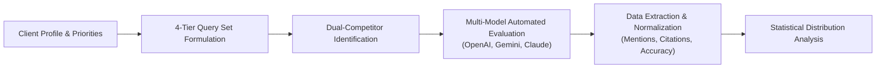
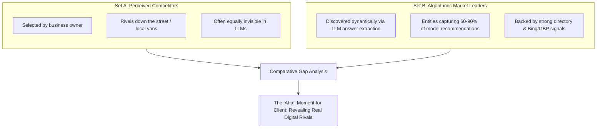
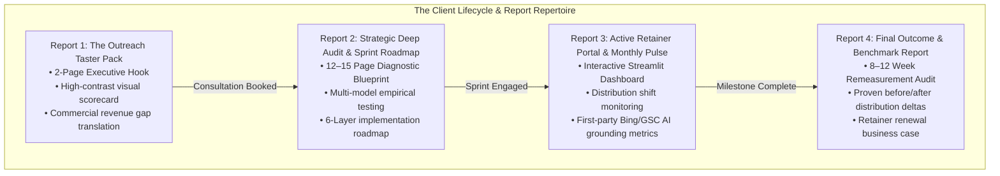
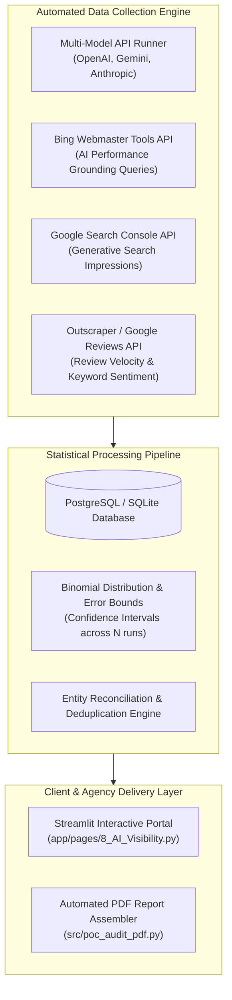

# End-to-End Operational Blueprint: Local AI Discoverability & Optimization Service

> **Documentation/sales review required — 1 October 2026.** Rating-threshold, guaranteed-inclusion
> and lost-contract language below conflicts with the platform's evidence standards. Do not reuse
> those claims in client materials pending review. See [the tracked review](../docs/sales-language-review.md).

**Date:** 25 September 2026  
**Document Type:** Master Operational Framework & Product Strategy  
**Target Sector:** UK Small & Medium Enterprises (Local Service Businesses, Trades, Commercial Providers)  
**System Architecture:** Multi-Model Evaluation (OpenAI, Gemini, Claude), Multi-Lever Execution, Streamlit Dashboarding

---

## Executive Summary

This blueprint defines the complete operational model for our Local AI Discoverability service. It synthesizes empirical research on LLM retrieval mechanics, lessons learned from real client audits (such as UDR Properties), and our codebase infrastructure into an integrated agency workflow.

### Core Strategic Shifts
1. **From Naive Queries to Intent-Driven Query Taxonomy:** Move from generic "cleaner in town" prompts to a 4-Tier Intent Matrix reflecting commercial value, customer fan-out behavior, and micro-geographies.
2. **Dual-Competitor Benchmarking:** Contrast the owner's *Perceived Competitors* against *Algorithmic Market Leaders* (the entities LLMs actually recommend).
3. **Multi-Lever Execution (Beyond the Website):** Execute across the 6-Layer Hierarchy (Crawlability, GBP/Bing/Apple grounding, UK vertical directories, review compliance under the UK DMCC Act 2024, high-margin on-site pages, and entity harmonization).
4. **The 4-Tier Deliverable Repertoire:** Replace bulky, single-audit reports with a targeted funnel: **Taster Pack $\rightarrow$ Strategic Deep Audit $\rightarrow$ Active Client Portal $\rightarrow$ Final Outcome Review**.
5. **Statistical Distribution Tracking:** Measure visibility as a probability distribution across 60–100 runs with confidence intervals, avoiding misleading single-run "rankings."

---

## 1. Optimizing the Client Audit & Discovery Process



### 1.1 Defining the Query Set (The 4-Tier Intent Matrix)
In audits like UDR Properties, testing only 8 generic questions risks skewing results or missing commercial intent. A robust evaluation must sample across four distinct search intents:

```
┌────────────────────────────────────────────────────────────────────────┐
│                   THE 4-TIER QUERY TAXONOMY                            │
├────────────────────────────────┬───────────────────────────────────────┤
│ Tier 1: Commercial / High-     │ Explicitly targets high-margin buyer  │
│         Contract Intent        │ personas (e.g. facility managers,    │
│                                │ commercial landlords, letting agents) │
├────────────────────────────────┼───────────────────────────────────────┤
│ Tier 2: Category Discovery &   │ Problem-aware consumer prompts asking │
│         Specific Needs         │ for specific solutions or timing      │
├────────────────────────────────┼───────────────────────────────────────┤
│ Tier 3: Comparative Shortlist  │ Evaluative prompts asking for "top",  │
│         & Vetting              │ "best", or vetted recommendations     │
├────────────────────────────────┼───────────────────────────────────────┤
│ Tier 4: Micro-Locality Fan-Out │ Prompts covering specific postal      │
│                                │ districts, neighborhoods, or quarters │
└────────────────────────────────┴───────────────────────────────────────┘
```

#### Applied Example: Commercial & Domestic Cleaning in Brighton & Hove
* **Tier 1 (High-Ticket Commercial):**
  * *"Which commercial cleaning companies in Brighton provide daily office cleaning with key-holding and COSHH compliance?"*
  * *"Recommend reputable end-of-tenancy cleaners in Hove approved by local letting agents."*
* **Tier 2 (Specific Needs & Problems):**
  * *"Who provides emergency commercial carpet steam cleaning in Brighton after a leak?"*
  * *"Best Airbnb turnover and laundry service for holiday lets near Brighton seafront."*
* **Tier 3 (Comparative & Vetting):**
  * *"Who are the top-rated contract cleaning services in Brighton and Hove?"*
  * *"Which commercial cleaners in Sussex have the best verified client reviews?"*
* **Tier 4 (Micro-Locality Fan-Out):**
  * *"Office cleaners near North Laine and central Brighton (BN1)."*
  * *"Commercial property maintenance in Hove and Portslade (BN3 / BN41)."*

*Target Sampling:* 12–16 carefully engineered prompts evaluated across 3 providers (OpenAI, Gemini, Claude) with 3–5 repetitions = **108–240 individual data points per audit**.

---

### 1.2 Defining the Competitor Benchmark: Perceived vs. Algorithmic

A common client mistake is assuming their main rivals are the companies they see driving around town. Our audit evaluates **two distinct competitor sets**:



1. **Set A: Owner-Nominated Competitors:**
   * Businesses the owner views as direct rivals (e.g., *Diamond Cleaning*, *SEB Services*).
   * *Value in Report:* We frequently show the owner that their traditional rivals **score 0 of 9 in AI recommendations as well**, proving this is an open race to claim first-mover advantage.
2. **Set B: Algorithmic Market Leaders:**
   * Entities that actually monopolize LLM answers (e.g., *Why Bother Cleaning*, *Silver Star Cleaning*, or Checkatrade-backed trades).
   * *Value in Report:* Demonstrates exactly whose revenue the client is losing and reveals the blueprint of what models reward (e.g., Silver Star's office-cleaning reviews or Why Bother's clear commercial homepage hierarchy).

---

## 2. The 6-Layer Multi-Lever Action Framework

Recommendations must not stop at website copy. Our agency delivers a full-stack discoverability framework across 6 defined layers:

```
[ Layer 1: Crawl & Technical Access ] → robots.txt, Cloudflare AI unblocking, WAF rules
[ Layer 2: Core Platform Grounding  ] → Google Business Profile, Bing Places (sync), Apple Business
[ Layer 3: Vertical Ecosystem       ] → Sector hubs (Checkatrade, MyBuilder, TripAdvisor, Yelp)
[ Layer 4: Review Engine & Proof    ] → Google reviews (4.5+ threshold) + DMCC Act 2024 compliance
[ Layer 5: Owned Web Substrate      ] → Dedicated service landing pages + inline review proof
[ Layer 6: Entity & Brand Mentions  ] → Companies House alignment, local press/editorial roundups
```

### Action Protocols by Layer:

#### Layer 1: Crawlability & Technical Access
* **Search Bot Unblocking:** Update `robots.txt` to explicitly allow `OAI-SearchBot`, `Claude-SearchBot`, `PerplexityBot`, `Bingbot`, and `Googlebot`.
* **Cloudflare / Firewall Audit:** Add a WAF bypass rule for `OAI-SearchBot` and `PerplexityBot` to prevent silent dropping under Cloudflare’s September 2026 default AI-blocking rules.

#### Layer 2: Core Platform Grounding (Google, Microsoft, Apple)
* **GBP Primary Category Selection:** Ground Google AI Mode (79.8% citation share) by aligning primary and secondary categories to high-margin targets.
* **Bing Places Automated Sync:** Set up 1-click import from GBP to Bing Places with automatic weekly synchronization to feed ChatGPT Search and Copilot.
* **Apple Business Connect:** Claim and complete the Apple Business place card to feed Siri and Apple Maps local intent.

#### Layer 3: Vertical Ecosystem Integration (Sector Hubs)
* **UK Trades & Property Services:** Establish an active, vetted profile on **Checkatrade** (which features an official native app inside ChatGPT and accounts for 78/80 trade citations) and **MyBuilder**.
* **Hospitality / Local:** Claim and optimize **Yelp** (leveraging OpenAI's July 2026 multi-million review licensing deal) and **TripAdvisor**.

#### Layer 4: Review Engine & Reputation Architecture
* **The 4.5+ Star Threshold:** Maintain a rating above 4.5 stars (90% of AI recommendations sit above this mark).
* **UK DMCC Act 2024 Compliance:** Strictly eliminate review gating, concealed incentives, or selective positive solicitation (CMA fines up to 10% global turnover).
* **Semantic Review Prompting:** Automate post-job SMS/email requests inviting customers to mention the specific service performed and locality.
* **Owner Reply Routine:** Maintain a 48-hour response SLA, naturally weaving in the service name and city.

#### Layer 5: Owned Web Substrate (High-Yield Page Architecture)
* **Dedicated Priority Service Pages:** Replace generic service overview lists with dedicated URLs for each priority service (e.g., `/commercial-cleaning-brighton`).
* **Direct-Answer FAQs:** Use H2/H3 headings matching natural LLM fan-out queries followed by concise 40–60 word factual answers.
* **Inline Proof Blocks:** Embed verified reviews for that specific service directly beside scope, specifications, and pricing terms.

#### Layer 6: Entity Harmonization & Authority
* **Canonical Entity Statement:** Align legal name, trading name, founding date (e.g., resolving 2017 vs 2018), registered office, and Companies House ID across the website footer, GBP, and schema.
* **Local PR:** Earn editorial mentions in trusted regional news (*The Argus*, *Brighton & Hove News*) and local chambers of commerce.

---

## 3. The 4-Tier Client Reporting Repertoire

To maximize sales conversion, delivery clarity, and long-term client retention, we decouple our reporting into four purpose-built deliverables:



---

### Report 1: The Outreach "Taster Pack" (Cold Outreach & Beta Clients)
* **Format:** 2-Page Visual PDF or Interactive Web Snapshot (+ 90-second personalized Loom video).
* **Objective:** Provoke curiosity, expose an unseen commercial risk, and book a diagnostic call.
* **Key Components:**
  1. **The Visual Contrast Scorecard:** A stark graphical contrast (e.g., Green Bar: Airbnb Cleaning = 63% vs Red Bars: Commercial, Office, Tenancy = 0%).
  2. **Commercial Revenue Translation:** Translating the gap into financial reality: *"When local companies ask AI for contract cleaners, 100% of recommendations go to Silver Star and Why Bother Cleaning. You are winning low-margin weekend turnarounds while missing out on £2,000/mo recurring office retainers."*
  3. **The 3-Step Teaser Plan:** Brief summary of the fixes (technical crawl check, Bing/GBP sync, priority service landing page).
  4. **Direct, Low-Friction Call-to-Action (CTA):** Calendar booking link for a 15-minute diagnostic walkthrough.

---

### Report 2: Strategic Deep Audit & Sprint Roadmap (Engaged Clients)
* **Format:** 12–15 Page Formal Strategic Document (delivered after engagement kick-off).
* **Objective:** Deliver exhaustive diagnostic clarity and set the baseline for delivery.
* **Key Components:**
  1. **Executive Diagnostic & Revenue Opportunity.**
  2. **The 4-Tier Intent Matrix Results:** Performance across all 12–16 queries and 3 providers (OpenAI, Gemini, Claude).
  3. **Dual Competitor Intelligence:**
     * Table 1: Performance of Owner's Nominated Competitors.
     * Table 2: The Top 5 Algorithmic Leaders (and why the models favor them).
  4. **6-Layer Gap Analysis Matrix:** Audit findings for Crawlability, Grounding, Directories, Reviews, On-Site Content, and Entity Consistency.
  5. **The 3-Phase Discovery Sprint Roadmap:** Clear week-by-week implementation plan with ownership assignments.
  6. **Technical Appendix:** Full logs, repetition indices, and source citations.

---

### Report 3: Active Client Dashboard & Monthly Pulse Reports (Active Retainers)
* **Format:** Interactive Streamlit Web Portal (`app/pages/8_AI_Visibility.py`) + 2-Page Monthly PDF Digest.
* **Objective:** Provide continuous visibility, track task delivery, and monitor engine behavior.
* **Dashboard Features:**
  * **Visibility Probability Tracker:** Tracks inclusion rates over time across models (e.g., Commercial Cleaning: Month 1 = 0% $\rightarrow$ Month 2 = 33% $\rightarrow$ Month 3 = 67%).
  * **Grounding Engine Ingestion:** Tracks real-time data from **Bing Webmaster Tools AI Performance Report** and **Google Search Console Generative AI queries**.
  * **Implementation Sprint Tracker:** Interactive checklist showing progress across the 6 layers (e.g., *Checkatrade verified*, *Bing Places synced*, *Landing page deployed*).
  * **Review & Sentiment Pulse:** Aggregates recent Google reviews, monitoring star velocity and semantic keyword mentions.

---

### Report 4: The Final Review & Outcome Benchmark (At 8–12 Weeks)
* **Format:** 8–10 Page Executive Impact Report.
* **Objective:** Prove ROI, validate visibility shifts, and secure an ongoing maintenance retainer.
* **Key Components:**
  1. **Before-and-After Distribution Delta:**
     * Direct comparison of the identical 72–108 query runs at Week 0 vs Week 10.
     * Statistical confidence intervals showing genuine upward shifts versus baseline noise.
  2. **Competitive Share-of-Voice Shift:** Visualizing market share captured from algorithmic leaders.
  3. **Completed 6-Layer Architecture Log:** Full inventory of all verified platform listings, deployed landing pages, and harmonized entity profiles.
  4. **The Ongoing Maintenance Pitch:** Explaining model drift, crawler updates, and competitor reactions to justify ongoing monitoring and monthly review management.

---

## 4. Technical Infrastructure & Tracking Architecture



### 4.1 Statistical Rigor & Non-Determinism Protocol
As proven by SparkToro and academic GEO benchmarks, LLMs are non-deterministic: the chance of getting the exact same recommendation list twice is under 1 in 100. **We never report single-run rankings.**

* **Binomial Sampling Model:** We treat AI visibility as a probability distribution ($p = k / n$).
* **Sampling Rule:**
  * Cold Taster Pack: 3 repetitions across 3 engines (minimum 9 runs per service intent).
  * Comprehensive Audit & Final Review: 5–10 repetitions across 3 engines (60–100 runs total).
* **Confidence Reporting:** Every client chart displays error bands (e.g., *"Commercial Cleaning Inclusion: 60% ± 11% at 95% Confidence"*). This reinforces our status as an honest, scientific authority.

### 4.2 Streamlit Dashboard Architecture (Leveraging Existing Codebase)
Our repository already contains a mature Streamlit application (`app/` and `src/`). We structure the client dashboard view around four core modules:

1. **`0_AI_Discovery_Scan.py` (Prospecting & Taster Generation):**
   * Input: Business Name + Stated Service Area.
   * Runs automated multi-intent query fan-out.
   * Generates the 2-Page Executive Taster PDF and visual scorecards.
2. **`8_AI_Visibility.py` (Deep Diagnostic & Live Tracking):**
   * Multi-provider comparison matrix (Claude vs Gemini vs OpenAI).
   * Intent-level breakdown (Commercial vs Domestic vs Specialist).
   * Source attribution map (percentage of citations coming from GBP, Bing, Checkatrade, or Owned Site).
3. **`9_AI_Competitive_Diagnostic.py` (Dual Competitor Intelligence):**
   * Head-to-head comparison against owner-nominated competitors and algorithmic leaders.
   * Dynamic entity matching and share-of-voice charts.
4. **`10_AI_Report_Generator.py` (Automated PDF Assembly):**
   * Compiles the 12–15 Page Strategic Blueprint and 8-Week Final Benchmark Report directly into production-ready PDFs.

---

## 5. Commercial Positioning: How to Sell the Service

When consulting with small-to-medium business owners, our language must remain commercially compelling and legally sound:

| Never Say (Over-Promised Hype) | Never Say (Academic Self-Doubt) | Say This (The Authoritative Agency Standard) |
| :--- | :--- | :--- |
| *"We will get your business ranked #1 inside ChatGPT."* | *"We tested some queries, but LLMs change constantly so we can't prove this matters."* | **"AI models recommend businesses that have verified multi-platform consensus. We align your data across Google, Microsoft, and industry directories so you are systematically included in the recommendation pool."** |
| *"Our proprietary AI prompt-injection code forces LLMs to recommend you."* | *"llms.txt and schema might help, but research shows it often does nothing."* | **"We skip unproven gimmicks that risk Google spam penalties. Instead, we implement the verified foundation: unblocking search bots, syncing with Bing/GBP, and placing real proof beside your high-margin services."** |
| *"You will double your revenue in 30 days."* | *"These appearance counts don't correlate to actual sales or phone calls."* | **"Right now, high-value commercial contracts are being routed directly to your competitors. Closing this visibility gap puts your high-margin services directly in front of businesses looking to buy today."** |

---

## 6. Implementation Timeline & Retainer Packaging

```
┌────────────────────────────────────────────────────────────────────────┐
│                        AGENCY PRODUCT OFFERING                         │
├───────────────────────────────┬────────────────────────────────────────┤
│ 1. AI Discoverability Sprint  │ Fixed Fee (£1,500 – £2,500)            │
│    (Weeks 1–6)                │ • 4-Tier Query Audit & Benchmark       │
│                               │ • Layer 1: Crawl & WAF unblocking      │
│                               │ • Layer 2: GBP & Bing Places auto-sync │
│                               │ • Layer 3: Vertical directory setup    │
│                               │ • Layer 4: DMCC review workflow setup  │
│                               │ • Layer 5: 1 Dedicated priority page   │
│                               │ • Layer 6: Entity harmonization        │
├───────────────────────────────┼────────────────────────────────────────┤
│ 2. AI Visibility Retainer     │ Monthly Retainer (£350 – £650/mo)      │
│    (Ongoing / Month 2+)       │ • Interactive Streamlit Client Portal  │
│                               │ • Monthly 100-run distribution audit   │
│                               │ • Grounding query tracking (Bing/GSC)  │
│                               │ • Review engine monitoring & reply SLA │
│                               │ • Quarterly landing page expansion     │
└───────────────────────────────┴────────────────────────────────────────┘
```
