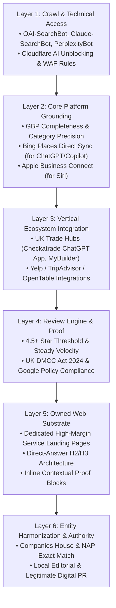
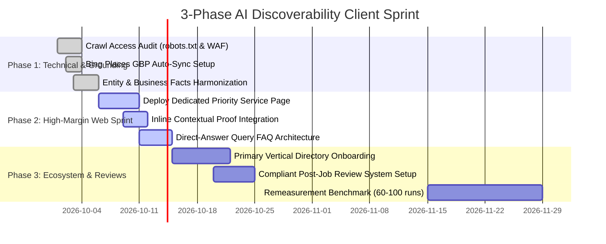

# Local AI Discoverability: Implementation Playbook & Standard Operating Procedure (SOP)

> **Documentation/sales review required — 1 October 2026.** Fixed rating cutoffs and universal
> inclusion/exclusion claims below require editorial correction and source verification. Do not reuse
> those claims in client materials pending review. See [the tracked review](../docs/sales-language-review.md).

**Date:** 20 September 2026  
**Document Type:** Technical & Operational Implementation Playbook  
**Target Audience:** Agency Technical Delivery Team & Client Account Managers  
**Scope:** UK Local Service Businesses (Trades, Commercial Cleaning, Hospitality, Professional Services)

---

## Executive Overview

Traditional Local SEO was largely single-platform (ranking in Google’s Local 3-Pack via Google Business Profile and local backlinks). **Generative Engine Optimization (GEO) and AI Discoverability operate across a multi-platform consensus model.**

AI assistants (ChatGPT Search, Google Gemini/AI Mode, Claude, Perplexity) do not rely on a single index or your owned website alone:
* **Google AI Mode/Gemini** pulls **79.8% of local citations directly from Google Maps/GBP** (Steady Demand, Aug 2026).
* **ChatGPT Search** relies heavily on **Bing index rankings** (Seer: 87% alignment) paired with its **July 2026 Yelp licensing deal** (330M reviews / 8M listings) and direct partner app integrations.
* **Claude Web Search** grounds via **Brave Search** (confirmed on Anthropic's official subprocessor list).
* **UK Local Trades** draw **71.9% of LLM citations from trade directories** like Checkatrade and MyBuilder (Murray Digital, Aug 2026).

This SOP translates our **6-Layer Multi-Lever Hierarchy** into concrete, repeatable engineering and operational workflows mapped across a **3-Phase Client Discovery Sprint**.

---

## Part 1: The 6-Layer Multi-Lever Implementation Guide



---

### Layer 1: Crawl & Technical Access (The Gatekeeper)

If an AI crawler cannot access your content, your site is entirely excluded from real-time grounding. Crawl-blocking is the #1 silent killer of AI visibility.

#### 1. Understanding Search Bots vs. Training Bots
Clients often fear AI scraping their intellectual property for model training. We must distinguish **Search Grounding Bots** (which bring live leads) from **Training Crawlers** (which scrape data for foundational models).

| Bot Name | Operator | Role | Agency Policy |
| :--- | :--- | :--- | :--- |
| `OAI-SearchBot` | OpenAI | Powers ChatGPT Search grounding | **MUST ALLOW** |
| `ChatGPT-User` | OpenAI | User-initiated on-demand fetching | **MUST ALLOW** |
| `GPTBot` | OpenAI | Pre-training foundation models | Client Discretion (Can block) |
| `Claude-SearchBot` | Anthropic | Search grounding via Brave index | **MUST ALLOW** |
| `ClaudeBot` | Anthropic | Training & broad crawl | Client Discretion (Can block) |
| `PerplexityBot` | Perplexity | Real-time answer retrieval | **MUST ALLOW** |
| `Googlebot` | Google | General Google search & AI Overviews | **MUST ALLOW** |
| `Google-Extended`| Google | Gemini model training opt-out | Client Discretion (Does not affect search) |
| `Bingbot` | Microsoft | Feeds Bing, Copilot, & ChatGPT Search | **MUST ALLOW** |

#### 2. Golden Standard `robots.txt` Configuration
Deploy this block at the root of the client’s site:

```txt
# ========================================================
# ALLOW SEARCH-GROUNDING AI ASSISTANTS (Mandatory for AI Visibility)
# ========================================================
User-agent: OAI-SearchBot
Allow: /

User-agent: ChatGPT-User
Allow: /

User-agent: Claude-SearchBot
Allow: /

User-agent: PerplexityBot
Allow: /

User-agent: Bingbot
Allow: /

User-agent: Googlebot
Allow: /

# ========================================================
# OPTIONAL: BLOCK TRAINING/SCRAPING IF CLIENT REQUESTS
# (Does NOT harm real-time search recommendation)
# ========================================================
User-agent: GPTBot
Disallow: /

User-agent: Google-Extended
Disallow: /

User-agent: ClaudeBot
Disallow: /
```

#### 3. Cloudflare & WAF Configuration Audit
* **The Cloudflare Default Trap:** On September 15, 2026, Cloudflare rolled out aggressive new default AI-blocking features ("Content Independence Day") for free and newly provisioned sites.
* **Audit Action:** 
  1. Log into Cloudflare Dashboard $\rightarrow$ **Security** $\rightarrow$ **Bots**.
  2. Ensure *"Block AI Scrapers and Crawlers"* does not indiscriminately drop `OAI-SearchBot` or `PerplexityBot`.
  3. Under **WAF** $\rightarrow$ **Custom Rules**, create an explicit bypass rule:
     `If (http.user_agent contains "OAI-SearchBot" or http.user_agent contains "PerplexityBot") -> Action: Bypass (Security Checks)`.

---

### Layer 2: Core Platform Grounding (Google, Bing, Apple)

Local AI recommendations rely on trusted geospatial and business registries.

#### 1. Google Business Profile (GBP) Optimization
* **Primary Category Precision:** Research proves primary category selection is the single largest factor for Google AI Mode inclusion. Avoid generic categories.
  * *Bad:* "Cleaning Service"
  * *Good:* "Commercial Cleaning Service" (if office contracts are priority) or "Carpet Cleaning Service".
* **Secondary Categories:** Add up to 5 specific secondary categories (e.g., *Upholstery Cleaning Service*, *End of Tenancy Cleaning Service*, *Window Cleaning Service*).
* **Predefined Services List:** Manually populate every single predefined service item with a clear pricing description and geographic delivery radius.
* **Geocoding & Operating Areas:** Clearly define postal districts (e.g., BN1, BN2, BN3, BN41 for Brighton & Hove) rather than typing "Sussex".

#### 2. Bing Places Direct Sync Pipeline (Feeds ChatGPT & Copilot)
* Because **Bing ranking correlates 87% with ChatGPT citations** (Seer Interactive), Bing Places is mandatory.
* **The 15-Minute Pipeline:**
  1. Access [Bing Places for Business](https://www.bingplaces.com/).
  2. Choose **"Import from Google Business Profile"**.
  3. Schedule **automatic weekly sync**. Any update made to GBP (hours, photos, services) now automatically pushes to Microsoft's graph, directly feeding Copilot and ChatGPT local searches.
  4. Access **Bing Webmaster Tools** $\rightarrow$ Navigate to the **AI Performance Report** (launched Feb 2026) to track grounding query impressions.

#### 3. Apple Business Connect (Feeds Apple Intelligence & Siri)
* Replaces the legacy Apple Maps Connect. Free worldwide (updated April 2026).
* Claim the location card, upload high-resolution cover photos, set primary categories, and add direct action links (e.g., "Request a Quote" linked directly to the client's service landing page).

---

### Layer 3: Vertical Ecosystem Integration (Sector Hubs)

AI models do not take a company's website at face value. When a prompt asks *"Who should I hire for X?"*, models execute **query fan-outs** to authoritative third-party aggregator lists.

#### 1. UK Trades & Property Maintenance Prioritization
In Murray Digital's August 2026 empirical benchmark, **71.9% of all sources cited in ChatGPT trade recommendations were trade directories**.
* **Checkatrade:** 
  * Cited in **78 of 80 answers** in UK trade tests.
  * Checkatrade launched an **official ChatGPT native app**. Having an active, vetted Checkatrade profile gives a direct data pipe into ChatGPT’s conversational recommendation engine.
* **MyBuilder:** Cited in **70 of 80 answers**.
* **TrustATrader & Which? Trusted Traders:** High secondary authority.
* **Action:** For property maintenance, cleaning, building, and trades, a vetted profile on at least *one* of these major platforms is non-negotiable.

#### 2. Hospitality, Leisure & General Local
* **Yelp:** OpenAI signed an official **exclusive local licensing deal with Yelp in July 2026** (330M reviews, 8M listings). Even though Yelp has lower consumer adoption in the UK than in the US, ChatGPT relies heavily on Yelp for local business card generation. Claim and fully populate a free Yelp listing.
* **TripAdvisor & OpenTable:** Dominant citation sources for food, hospitality, and leisure across Perplexity and Gemini.

---

### Layer 4: Review Engine & Reputation Architecture

Reviews provide the semantic proof that AI models use to validate that a business actually delivers what it claims.

#### 1. The 4.5+ Star Threshold & Sentiment Benchmarks
* In Steady Demand’s August 2026 index, **90% of AI-recommended local businesses held a rating of 4.5 stars or higher**, with an average rating of **4.75 stars**.
* Businesses below 4.2 stars are systematically excluded from "Best [service] in [city]" consideration sets.

#### 2. Strict Legal Compliance: The UK DMCC Act 2024 & CMA208
As of April 2025, the **Digital Markets, Competition and Consumers (DMCC) Act 2024** is legally in force under the Competition and Markets Authority (CMA). The CMA has statutory powers to levy fines of **up to 10% of global annual turnover** for misleading review practices.

```
┌─────────────────────────────────────────────────────────────────────────┐
│                      CRITICAL COMPLIANCE NOTICE                         │
│ Under the DMCC Act 2024 Schedule 20 and CMA Guidance CMA208:             │
│ 1. NEVER incentivize reviews (no discounts, vouchers, cash, or freebies).│
│ 2. NEVER engage in "Review Gating" (sending happy customers to Google   │
│    and unhappy customers to a private feedback form).                   │
│ 3. NEVER publish misleading proof (omitting genuine negative reviews    │
│    or writing fake case studies).                                       │
│ 4. Google's Terms of Service separately prohibit selective solicitation. │
└─────────────────────────────────────────────────────────────────────────┘
```

#### 3. Compliant Review Generation Workflow
* **The "Universal Post-Job Ask":** Send an automated, neutral SMS or email to **100% of customers** 2–4 hours after job completion.
* **Compliant Prompting:** Do *not* ask for "a 5-star review". Ask for specific descriptive feedback:
  * *Template:* "Hi [Name], thank you for choosing [Company] today! Could you take 60 seconds to leave us an honest review on Google? If you mention which service we provided (e.g., office cleaning, carpet clean), it helps our local team immensely: [Short Link]"
* **Semantic Grounding in Reviews:** When customers naturally mention the service name (*"carpet cleaning"*, *"commercial tenancy"*) in their review text, LLMs ingest these as verified semantic proof entities.

#### 4. The Owner Reply Protocol
* **89% of consumers and LLM evaluators expect owner responses** (BrightLocal 2026).
* Respond to every review within 48 hours.
* **Response Template:** Incorporate the service and locality naturally:
  * *"Thank you for the feedback, [Name]! Our team takes great pride in delivering commercial office cleaning across Brighton & Hove. We look forward to seeing you next week."*

---

### Layer 5: Owned Web Substrate (High-Yield Page Architecture)

Once the off-site and grounding layers are in place, the website acts as the final factual anchor. We eliminate unproven gimmicks (`llms.txt`, hidden prompt injection) in favor of **structured, direct-answer page architecture**.

#### 1. Dedicated Priority Service Landing Pages
Never lump high-margin services into a single bulleted "Services" overview. Each priority requires a dedicated URL (e.g., `udrproperties.co.uk/commercial-cleaning-brighton`).

**Essential Page Anatomy:**
```
[ H1: Service Title + Primary Location ]
  └── Clear 2-sentence summary answering: Who, What, Where.

[ Quick-Facts Matrix (Table or Definition List) ]
  ├── Service Scope: Exactly what is included & excluded.
  ├── Sectors Served: Offices, medical clinics, retail, schools.
  ├── Compliance/Specs: COSHH certified, £5M Public Liability, DBS checked.
  ├── Commercial Terms: Key-holding, invoicing, VAT status, frequencies.
  └── Service Area: Brighton, Hove, Portslade, Shoreham, Lewes.

[ The Inline Customer Proof Block ]
  └── 2-3 verbatim Google reviews specifically referencing THIS service.
  └── Source citation, reviewer first name, and date.

[ Direct-Answer FAQ (H2/H3 Fan-Out Match) ]
  └── "How often do you provide commercial office cleaning?"
  └── "Do you provide your own commercial equipment and eco-friendly products?"
  └── "What are your key-holding and security procedures?"

[ Clear Actionable CTA ]
  └── Telephone number, direct email, free quote booking form.
```

#### 2. Direct-Answer Formatting for LLM Extraction
LLMs extract answers most cleanly when headings are phrased as natural-language questions, immediately followed by a concise 40–60 word factual answer:

```markdown
### What is included in your Brighton end-of-tenancy clean?
Our Brighton end-of-tenancy cleaning strictly adheres to agency inventory checklists. It covers deep kitchen degreasing, oven cleaning, full bathroom descaling, inside window cleaning, and skirting board washing. Carpet steam cleaning can be added as a combined package.
```

---

### Layer 6: Entity Harmonization & Authority (The Anchor)

LLMs penalize entity ambiguity. If an AI engine cannot definitively reconcile whether two business names refer to the same legal entity, it will avoid recommending either.

#### 1. Reconciling Legal Name vs. Trading Name
Take UDR Properties as a direct example:
* **The Conflict:** Saved pages listed establishment as both **2017** and **2018**, with mentions of both *UDR Cleaning* and *UDR Properties Limited*.
* **The Resolution:** Publish a standard, canonical Business Identity block in the website footer and schema:
  * *Legal Name:* UDR Properties Limited
  * *Trading Name:* UDR Cleaning & Property Services
  * *Company Registration No:* [Companies House 8-digit ID]
  * *Established:* 2017 (Founded) / Incorporated 2018
  * *Registered Office:* Exact address matching Companies House and GBP.

#### 2. Digital PR & Legitimate Local Editorial
* **Warning on Paid Listicles:** Google’s spam updates (Dec 2025 / May 2026) actively demote websites heavily marketing via self-promotional listicles (Lily Ray observed 30–50% organic drops). Paying for undisclosed "Top 10" placements also violates UK advertising law (ASA/CAP).
* **Legitimate Local PR Tactics:**
  * Submit expert commentary or local business milestone stories to local publications (*The Argus*, *Brighton & Hove News*, *Latest Brighton*).
  * Register with local chambers of commerce (*Brighton Chamber*, *Federation of Small Businesses*).
  * Ensure presence in verified local authority directories (*VisitBrighton* where applicable).

---

## Part 2: The 3-Phase Discovery Sprint (Replacing Actions 1–3)

When presenting our recommendations to clients, we replace the narrow on-site recommendations with this structured 3-Phase Delivery Sprint:



### Phase 1: Technical Accessibility & Entity Grounding (Weeks 1–2)
*Goal: Zero client effort. Ensure the business is fully unblocked and indexed across the core engine graphs.*
* **Action 1.1:** Audit and update `robots.txt` and Cloudflare WAF rules to ensure `OAI-SearchBot`, `Claude-SearchBot`, and `PerplexityBot` have unrestricted access.
* **Action 1.2:** Connect Google Business Profile directly into **Bing Places** via automated sync, claiming Apple Business Connect.
* **Action 1.3:** Publish a canonical entity statement on the website footer harmonizing Companies House data, trading names, and founding dates.

### Phase 2: High-Margin Service Landing & Inline Proof (Weeks 3–4)
*Goal: Build the owned content substrate for the client's #1 most profitable service category.*
* **Action 2.1:** Design and launch a dedicated, standalone landing page for their top priority (e.g., *Commercial Office Cleaning Brighton*).
* **Action 2.2:** Embed verified, relevant customer proof blocks directly adjacent to the service description, explicitly answering commercial buyer concerns (insurance, key-holding, frequencies).
* **Action 2.3:** Add structured direct-answer FAQs targeting high-intent fan-out queries.

### Phase 3: Category Consideration Set & Review Engine (Weeks 5–8)
*Goal: Secure third-party consensus and build continuous review velocity.*
* **Action 3.1:** Complete verification on the dominant sector platform (e.g., Checkatrade for trades/cleaning; TripAdvisor/Yelp for hospitality).
* **Action 3.2:** Implement an automated post-job review invitation workflow adhering strictly to the UK DMCC Act 2024.
* **Action 3.3 (Follow-up at 8–12 Weeks):** Execute a complete 72-answer remeasurement benchmark to quantify visibility shifts against baseline competitors.

---

## Part 3: Operational Checklist for Client Delivery

| Task | Assignee | Tool / Platform | Target Time | Verified Output |
| :--- | :--- | :--- | :--- | :--- |
| **Robots.txt & WAF Check** | Tech Lead | cURL / Cloudflare Dashboard | 30 mins | Bot HTTP 200 responses |
| **Bing Places GBP Sync** | SEO Ops | Bing Places Admin | 20 mins | Sync active confirmation |
| **Apple Business Connect** | SEO Ops | Apple Business Portal | 30 mins | Verified place card |
| **Entity Facts Alignment** | Copywriter | WordPress / Webflow CMS | 45 mins | Updated canonical footer |
| **Priority Service Page** | Web Dev | CMS / Page Builder | 3–4 hours | Live indexable URL |
| **Proof Block Embedding** | Web Dev | CMS | 1 hour | Published review blocks |
| **Vertical Directory Setup** | Client / Ops | Checkatrade / Yelp Portal | 1–2 hours | Live verified profile |
| **Review Workflow Setup** | SEO Ops | CRM / Email / SMS Tool | 1 hour | Automated send trigger |

---

## Summary

By executing across all 6 layers rather than treating AI Discoverability as a cosmetic website edit:
1. We align with how AI search engines **actually retrieve data** (Maps, Bing, directories, reviews, and websites).
2. We insulate clients from **legal and search-spam penalties** by strictly rejecting prompt-injection tricks, cloaking, and review gating.
3. We provide clients with a structured, professional roadmap that delivers immediate technical value while building long-term commercial discoverability.
